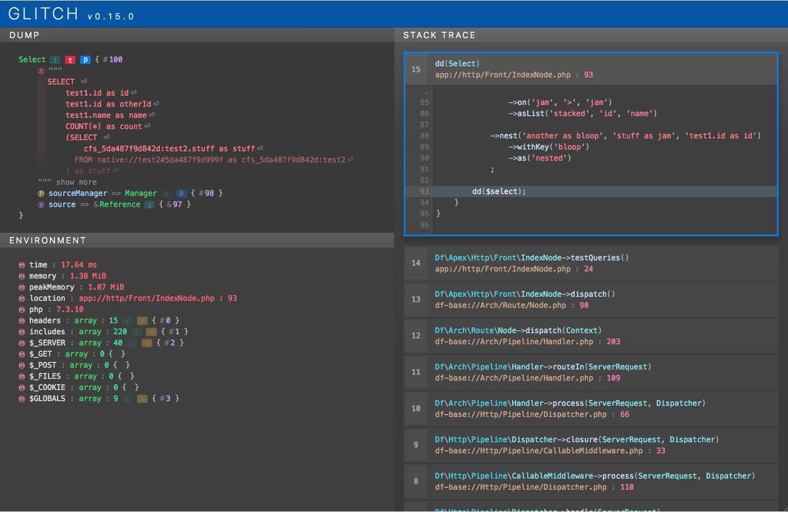

# Glitch

[](https://packagist.org/packages/decodelabs/glitch)
[](https://packagist.org/packages/decodelabs/glitch)
[](https://packagist.org/packages/decodelabs/glitch)
[](https://travis-ci.org/decodelabs/glitch)
[](https://github.com/phpstan/phpstan)
[](https://packagist.org/packages/decodelabs/glitch)

### Better tools for when things go wrong

Glitch is a standalone PHP package designed to improve end-to-end error generation, handling and inspection when developing your applications.

The project aims to provide a radically enhanced Exception framework that decouples the _meaning_ of an Exception from the underlying _implementation_ functionality, alongside deep data inspection tools and an Exception handling interface.




## Installation
Glitch should be installed via composer

```bash
composer require decodelabs/glitch
```


### Importing

Glitch uses [Veneer](https://github.com/decodelabs/veneer) with its frontage registered at <code>DecodeLabs\\Glitch</code>.
You can access all of the primary functionality through this frontage:

```php
use DecodeLabs\Glitch;

Glitch::getRunMode();
Glitch::dump('hello');
```

### Setup

Otherwise, Glitch works out of the box without any special setup.
There are however some optional steps you can take to customise operation.


Register as the default error handler:

```php
Glitch::registerAsErrorHandler();
```


Register base path aliases for easier reading of file names in dumps:

```php
Glitch::registerPathAlias('app', '/path/to/my/app');

/*
/path/to/my/app/models/MyModel.php

becomes

app://models/MyModel.php
*/
```

Pass the <code>microtime()</code> of initial app launch for timing purposes:

```php
Glitch::setStartTime(microtime(true));
```


Set run mode (<code>development | testing | production</code>) so Glitch can format output correctly:

```php
Glitch::setRunMode('development');
```


## Dumps
Dump anything and everything easily, using simple global functions.
The functions mirror those used in Symfony/VarDumper, maintaining compatibility by using Symfony's VarDumper interface if it is already loaded.

```php
class MyThing {}
$myObject = new MyThing();

// This will dump the object and carry on
dump($myObject);

// This will dump the object and exit
dd($myObject);
```

You can also mark functions as incomplete whilst in development:
```php
function myFunction() {
    // This will throw a Glitch exception
    Glitch::incomplete([
        'info' => 'some test info'
    ]);
}
```

#### Renderers
The resulting dump UI (when using the HTML renderer, the default option) is injected into an iframe at runtime so can be rendered into any HTML page without breaking anything. If the page is otherwise empty, the iframe will expand to fill the viewport if possible.

The dump output is rendered by an instance of <code>DecodeLabs\Glitch\Renderer</code> which can be overridden on the default <code>Context</code> at startup. The <code>Html</code> renderer is loaded under http sapi, the <code>Cli</code> renderer is used when under the CLI sapi.

Custom renderers may convert <code>Entities</code> to other output formats depending on where they should be sent, such as Xml or Json for example.

#### Custom colours
The HTML renderer uses css variables to style individual element colours and can be overridden with custom values.
Create a custom css file with variable overrides:

```css
:root {
    --string: purple;
    --binary: green;
}
```

See [colours.scss](./src/Glitch/Renderer/assets/scss/_colours.scss) for all of the current colour override options.

Then load the file into the HTML renderer:

```php
Glitch::getRenderer()->setCustomCssFile('path/to/my/file.css');
```

#### Transports
Once rendered, the dump information is delivered via an instance of <code>DecodeLabs\Glitch\Transport</code>, also overridable on the default <code>Context</code>. It is the responsibility of the <code>Transport</code> to deliver the rendered dump.

By default, the render is just echoed out to <code>STDOUT</code>, however custom transports may send information to other interfaces, browser extensions, logging systems, etc.


### Custom dumps
You can customise how your own class instances are dumped by implementing <code>DecodeLabs\Glitch\Dumpable</code> and / or providing a <code>glitchDump</code> method.
The method should either yield or return a list of key / value pairs that populate the requisite fields of the dumper entity.

```php
use DecodeLabs\Glitch\Dumpable;

class MyClass implements Dumpable {

    public $myValue = 'Some text';

    private $otherObject;

    protected $arrayValues = [
        'row1' => [1, 2, 3]
    ];

    public function glitchDump(): iterable {
        yield 'text' => $this->myValue;

        // !private, *protected
        yield 'property:!otherObject' => $this->otherObject;

        yield 'values' => $this->arrayValues;
    }
}
```

The <code>Dumpable</code> interface is **NOT** _required_ - Glitch will check for the existence of the method regardless, which is useful if you do not want to rely on a dependency on the Glitch library just to provide better dump handling. However if you _do_ have Glitch in your dependency tree, it is recommended you fully implement the <code>Dumpable</code> interface for the best possible compatibility.


## Exceptions
Glitch exceptions can be used to greatly simplify how you create and throw errors in your code, especially if you are writing a shared library.

Throw <code>Glitches</code> rather than <code>Exceptions</code>, passing interface names to be mixed in as the method name (custom generated error interfaces must be prefixed with E) to the Glitch call.

```php
throw Glitch::EOutOfBounds('This is out of bounds');

// Implement multiple interfaces
throw Glitch::{'ENotFound,EBadMethodCall'}(
    "Didn't find a thing, couldn't call the other thing"
);

// You can associate a http code too..
throw Glitch::ECompletelyMadeUpMeaning('My message', [
    'code' => 1234,
    'http' => 501
]);

// Implement already existing Exception interfaces
throw Glitch::{'EInvalidArgument,Psr\\Cache\\InvalidArgumentException'}(
    'Cache items must implement Cache\\IItem',
    ['http' => 500],  // params
    $item             // data
);

// Reference interfaces using a path style
throw Glitch::{'../OtherNamespace/OtherInterface'}('My exception');
```

Catch a Glitch in the normal way using whichever scope you require:

```php
try {
    throw Glitch::{'ENotFound,EBadMethodCall'}(
        "Didn't find a thing, couldn't call the other thing"
    );
} catch(\Exception | \EGlitch | \ENotFound | MyLibrary\EGlitch | MyLibrary\AThingThatDoesStuff\EBadMethodCall | BadMethodCallException $e) {
    // All these types will catch
    dd($e);
}
```


### Traits

Custom functionality can be mixed in to the generated Glitch automatically by defining traits at the same namespace level as any of the interfaces being implemented.

```php
namespace MyLibrary;

trait EBadThingTrait {

    public function getCustomData(): ?string {
        return $this->params['customData'] ?? null;
    }
}

class Thing {
    public function doAThing() {
        throw Glitch::EBadThing('A bad thing happened', [
            'customData' => 'My custom info'
        ]);
    }
}
```


## Wrapping exceptions

If you want to present a unified interface in your own libraries, you ideally need to ensure that the only exceptions you throw from your library are from your libraries namespace - exceptions thrown by third party libraries called by _your_ library may need to be wrapped to maintain namespace isolation.

The old, long way:

```php
namespace My\Library;

use Someone\Elses\Thing;

class MyClass {
    public function doSomething() {
        $thing = new Thing();

        try {
            return $thing->doIt();
        } catch(Someone\Elses\ThingException $e) {
            throw new My\Library\ThingException($e->getMessage(), $e->getCode(), $e);
        }
    }
}
```

Glitch offers a <code>contain()</code> method that will wrap your third party code and automatically convert any throw exceptions to Glitch exceptions from the primary stack frame and namespace of your library:

```php
namespace My\Library;

use Someone\Elses\Thing;

class MyClass {
    public function doSomething() {
        $thing = new Thing();

        /*
         * If doIt() throws an exception from Someone\Elses namespace, Glitch will
         * wrap it and throw a Glitch exception from My\Library.
         */
        return Glitch::contain(function() use($thing) {
            return $thing->doIt();
        }, function($e) {
            /*
             * Optionally, you can send a second function to contain() inspect the source
             * exception and return the required types for the output Glitch
             */
            if($e instanceof Someone\Elses\ThingException) {
                return 'EThingGoneWrong';
            } else {
                return 'ERuntime';
            }
        });
    }
}
```

## Other information
- [Rationale for Glitch Exceptions](docs/Rationale.md)
- [An explanation of how the Glitch interface works](docs/HowItWorks.md)


## Licensing
Glitch is licensed under the MIT License. See [LICENSE](./LICENSE) for the full license text.
