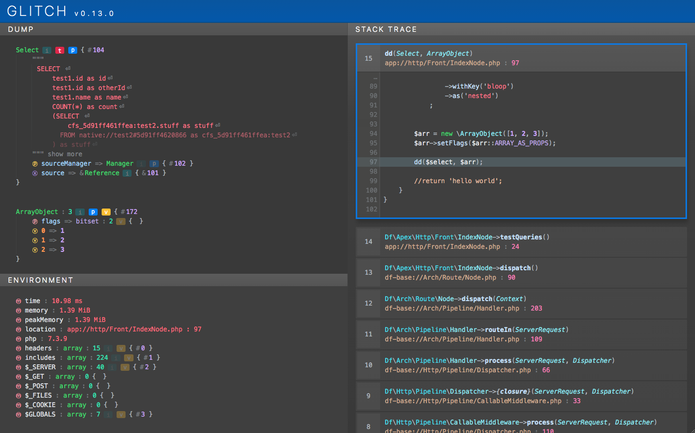

# Glitch
### Better exceptions for PHP.

Glitch is a standalone PHP package designed to improve end-to-end error generation, handling and inspection when developing your applications.

The project aims to provide a radically enhanced Exception framework that decouples the _meaning_ of an Exception from the underlying _implementation_ functionality, alongside deep data inspection tools and an Exception handling interface.



## Installation
Glitch should be installed via composer

```bash
composer require decodelabs/glitch
```


### Setup
Glitch will work out of the box with minimal setup. It uses a [Veneer Facade](https://github.com/decodelabs/veneer) so you can use it in any namespace context without having to import anything.

There are however some optional steps you can take to customise operation.

Register base path aliases for easier reading of file names in dumps:

```php
Glitch::registerPathAlias('app', '/path/to/my/app');

/*
/path/to/my/app/models/MyModel.php

becomes

app://models/MyModel.php
*/
```

Pass the <code>microtime()</code> of initial app launch if necessary:

```php
$time = microtime(true);
Glitch::setStartTime($time);
```


## Dumps
Dump anything and everything easily, using simple global functions.
The functions mirror those used in Symfony/VarDumper, maintaining compatibility by using Symfony's VarDumper interface if it is already loaded.

```php
class MyThing {}
$myObject = new MyThing();

// This will dump the object and carry on
dump($myObject);

// This will dump the object and exit
dd($myObject);
```

You can mark also functions as incomplete whilst in development:
```php
function myFunction() {
    // This will throw a Glitch exception
    Glitch::incomplete([
        'info' => 'some test info'
    ]);
}
```

#### Renderers
The resulting dump UI (when using the HTML renderer, the default option) is injected into an iframe at runtime so can be rendered into any HTML page without breaking anything. If the page is otherwise empty, the iframe will expand to fill the viewport if possible.

The dump output is rendered by an instance of <code>DecodeLabs\Glitch\Renderer</code> which can be overridden on the default <code>Context</code> at startup. By default the <code>Html</code> renderer is loaded under normal circumstances, the <code>Cli</code> renderer is used when under the CLI sapi.

Custom renderers may convert <code>Entities</code> to other output formats depending on where they should be sent, such as Xml or Json for example.

#### Custom colours
The HTML renderer uses css variables to style individual element colours and can be overridden with custom values.
Create a custom css file with variable overrides:

```css
:root {
    --string: purple;
    --binary: green;
}
```

See [colours.scss](./src/Glitch/Renderer/assets/_colours.scss) for all of the current colour override options.

Then load the file into the HTML renderer:

```php
Glitch::getRenderer()->setCustomCssFile('path/to/my/file.css');
```

#### Transports
Once rendered, the dump information is delivered via an instance of <code>DecodeLabs\Glitch\Transport</code>, also overridable on the default <code>Context</code>. It is the responsibility of the <code>Transport</code> to deliver the rendered dump.

By default, the render is just echoed out to <code>STDOUT</code>, however custom transports may send information to other interfaces, browser extensions, logging systems, etc.


## Exceptions
Glitch exceptions can be used to greatly simplify how you create and throw errors in your code, especially if you are writing a shared library.

Throw <code>Glitches</code> rather than <code>Exceptions</code>, passing interface names to be mixed in as the method name (custom generated error interfaces must be prefixed with E) to the Glitch call.

```php
throw Glitch::EOutOfBounds('This is out of bounds');

// Implement multiple interfaces
throw Glitch::{'ENotFound,EBadMethodCall'}(
    "Didn't find a thing, couldn't call the other thing"
);

// You can associate a http code too..
throw Glitch::ECompletelyMadeUpMeaning('My message', [
    'code' => 1234,
    'http' => 501
]);

// Implement already existing Exception interfaces
throw Glitch::{'EInvalidArgument,Psr\\Cache\\InvalidArgumentException'}(
    'Cache items must implement Cache\\IItem',
    ['http' => 500],  // params
    $item             // data
);

// Reference interfaces using a path style
throw Glitch::{'../OtherNamespace/OtherInterface'}('My exception');
```

Catch a Glitch in the normal way using whichever scope you require:

```php
try {
    throw Glitch::{'ENotFound,EBadMethodCall'}(
        "Didn't find a thing, couldn't call the other thing"
    );
} catch(\Exception | \EGlitch | \ENotFound | MyLibrary\EGlitch | MyLibrary\AThingThatDoesStuff\EBadMethodCall | BadMethodCallException $e) {
    // All these types will catch
    dd($e);
}
```


### Traits

Custom functionality can be mixed in to the generated Glitch automatically by defining traits at the same namespace level as any of the interfaces being implemented.

```php
namespace MyLibrary;

trait EBadThingTrait {

    public function getCustomData(): ?string {
        return $this->params['customData'] ?? null;
    }
}

class Thing {
    public function doAThing() {
        throw Glitch::EBadThing('A bad thing happened', [
            'customData' => 'My custom info'
        ]);
    }
}
```


## Other information
[Rationale for Glitch Exceptions](docs/Rationale.md)


## Licensing
Glitch is licensed under the MIT License. See [LICENSE](./LICENSE) for the full license text.
